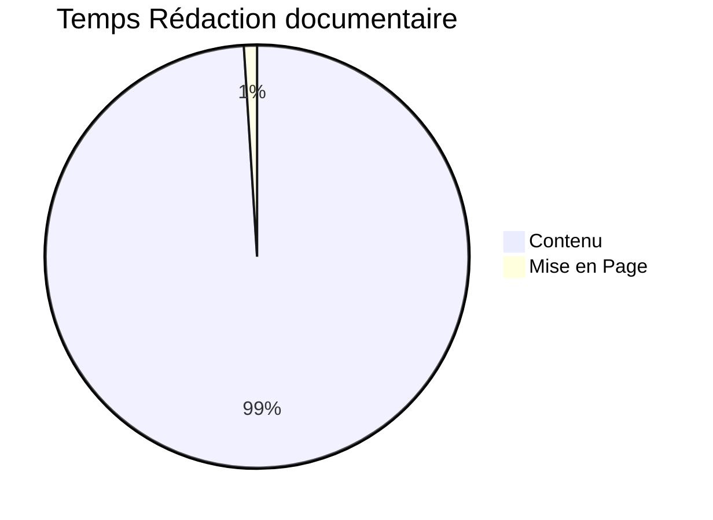

# Markdown to PDF
## Exemples de mise en formes et leurs contenu
---

<div class="page"/>

<!-- Documents ========================= -->
### 1. Exemple page de relecture:


<div class="document-status" />

| DOCUMENT STATUS: | IN PROGRESS |
| :--------------- | :---------- |

<div class="document-resume" />

***RESUME:***
Voici le résumé de mon histoire ça peut être court comme long et c'est tant mieux.

<div class="document-validation" />

| VALIDATION CIRCUIT | NAME  | FUNCTION | SIGNATURE and DATE |
| :----------------- | :---: | :------: | :----------------: |
| WRITTEN BY:        |       |          |                    |
| APPROUVED BY:      |       |          |                    |
| CLIENT APPROVAL:   |       |          |                    |

<div class="page"/>


```markdown
<div class="document-status" />

| DOCUMENT STATUS: | IN PROGRESS |
| :--------------- | :---------- |
```

```markdown
<div class="document-resume" />

***RESUME:***
Voici le résumé de mon histoire ça peut être court comme long et c'est tant mieux.
```

```markdown
<div class="document-validation" />

| VALIDATION CIRCUIT | NAME  | FUNCTION | SIGNATURE and DATE |
| :----------------- | :---: | :------: | :----------------: |
| WRITTEN BY:        |       |          |                    |
| APPROUVED BY:      |       |          |                    |
| CLIENT APPROVAL:   |       |          |                    |
```

<div class="page"/>


<div class="table-of-content"/>

## Table of content:

<div class="table-of-content"/>

- [1. Exemple page de relecture:](#1-exemple-page-de-relecture)
- [2. Contenu d'un document:](#2-contenu-dun-document)
  - [2.1. Chapitre niveau 2](#21-chapitre-niveau-2)
    - [2.1.1. Chapitre niveau 3](#211-chapitre-niveau-3)


```markdown
<div class="table-of-content"/>

## Table des matières:

<div class="table-of-content"/>

- [1. Exemple page de relecture:](#1-exemple-page-de-relecture)
- [2. Contenu d'un document:](#2-contenu-dun-document)
  - [2.1. Chapitre niveau 2](#21-chapitre-niveau-2)
    - [2.1.1. Chapitre niveau 3](#211-chapitre-niveau-3)
- [3. Exemple de Courrier \& Factures:](#3-exemple-de-courrier--factures)

```

<div class="page"/>

### 2. Contenu d'un document:

#### 2.1. Chapitre niveau 2

##### 2.1.1. Chapitre niveau 3

***Contenu:***
Lorem Ipsum is simply dummy text of the printing and typesetting industry. Lorem Ipsum has been the industry's standard dummy text ever since the 1500s, when an unknown printer took a galley of type and scrambled it to make a type specimen book. It has survived not only five centuries, but also the leap into electronic typesetting, remaining essentially unchanged. It was popularised in the 1960s with the release of Letraset sheets containing Lorem Ipsum passages, and more recently with desktop publishing software like Aldus PageMaker including versions of Lorem Ipsum.





<div class="page" />

```markdown
### 2. Contenu d'un document:

#### 2.1. Chapitre niveau 2

##### 2.1.1. Chapitre niveau 3

***Contenu:***
Lorem Ipsum is simply dummy text of the printing and typesetting industry. Lorem Ipsum has been the industry's standard dummy text ever since the 1500s, when an unknown printer took a galley of type and scrambled it to make a type specimen book. It has survived not only five centuries, but also the leap into electronic typesetting, remaining essentially unchanged. It was popularised in the 1960s with the release of Letraset sheets containing Lorem Ipsum passages, and more recently with desktop publishing software like Aldus PageMaker including versions of Lorem Ipsum.

```

<pre class="hljs"><code><div>```mermaid
pie title Temps Rédaction documentaire
        "Contenu" : 99
        "Mise en Page" : 1
```
</div></code></pre>

<div class="page" />


<!-- Courriers, Lettres ========================= -->

### 3. Exemple de Courrier & Factures:

<div class="courrier-expediteur" />

**SAS RESOLVABLE**
Adresse...
CODE Postal + Ville...
FRANCE

<div class="courrier-destinataire" />

**Client...**
Adresse...
CODE Postal + Ville...
PAYS...

<div class="courrier-objet" />

***Objet du courrier***
*Complément...*


<div class="facture-validite" />

| Date d'émission : JJ/MM/AAAA | Validité: *30 jours* |
| :--------------------------- | -------------------: |

<div class="facture-content" />

| REF: | DESIGNATION |  TVA | PRIX HT |
| :--- | :---------- | ---: | ------: |
| REF: | DESIGNATION |  20% |      0€ |
| REF: | DESIGNATION |  20% |      0€ |

<div class="facture-conditions" />

En cas de retard de paiement, une pénalité de 3 fois le taux d'intérêt légal sera appliqué à laquelle s'ajoutera une indemnité forfaitaire pour frais de recouvrement de 40€.
**Virement à effectuer sur le compte:**
**IBAN: *XXXX XXXX XXXX XXXX***
**BIC: *MA BANQUE***

<div class="facture-total" />

|       TOTAL HT |    0€ |
| -------------: | ----: |
|    Montant TVA |    0€ |
|      TOTAL TTC |    0€ |
| Durée (Ouvrés) | 365 J |


<div class="page"/>


```markdown
<div class="courrier-expediteur" />

**SAS RESOLVABLE**
Adresse...
CODE Postal + Ville...
FRANCE
```

```markdown
<div class="courrier-destinataire" />

**Client...**
Adresse...
CODE Postal + Ville...
PAYS...
```

```markdown
<div class="courrier-objet" />

***Objet du courrier***
*Complément...*
```

```markdown
<div class="facture-validite" />

| Date d'émission : JJ/MM/AAAA | Validité: *30 jours* |
| :--------------------------- | -------------------: |

<div class="facture-content" />

| REF: | DESIGNATION |  TVA | PRIX HT |
| :--- | :---------- | ---: | ------: |
| REF: | DESIGNATION |  20% |      0€ |
| REF: | DESIGNATION |  20% |      0€ |
```

<div class="page"/>

```markdown
<div class="facture-conditions" />

En cas de retard de paiement, une pénalité de 3 fois le taux d'intérêt légal sera appliqué à laquelle s'ajoutera une indemnité forfaitaire pour frais de recouvrement de 40€.
**Virement à effectuer sur le compte:**
**IBAN: *XXXX XXXX XXXX XXXX***
**BIC: *MA BANQUE***

<div class="facture-total" />

|       TOTAL HT |    0€ |
| -------------: | ----: |
|    Montant TVA |    0€ |
|      TOTAL TTC |    0€ |
| Durée (Ouvrés) | 365 J |
```


